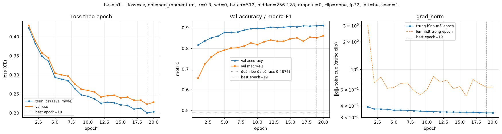
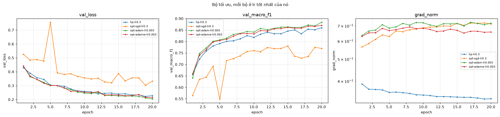

# Báo cáo Lab Day 1 — Nguyễn Trần Kiên — 2A202602571

Mọi con số trỏ về một `exp_id` trong `experiments.xlsx` và ảnh `figures/<exp_id>.png`. Mục 2–3 chỉ dùng **val**; eval chỉ xuất hiện ở mục 4.

## 1. Thiết lập

- **Môi trường:** máy cá nhân, GPU RTX 4050 Laptop, PyTorch 2.14.0+cu126.
- **Dữ liệu:** Forest CoverType; `train` 464 809 / `eval` 116 203. Validation 20% của train (phân tầng, seed 42) → 371 847 train / 92 962 val. Chuẩn hoá 10 cột số bằng thống kê của phần train còn lại.
- **Baseline:** `M-base` (54→256→128→7, 47 879 tham số), CE, SGD + momentum 0,9, lr 0,3 (chọn bằng val), batch 512, 20 epoch, He, dropout 0, không clip, FP32.
- **Quy ước đo:** train loss đo ở `eval()` trên toàn bộ train; metric lấy tại epoch có val loss thấp nhất; `grad_norm` đo trước khi clip.
- **Mốc:** accuracy "đoán lớp đa số" trên val = 0,4876.
- **Chủ đề đã thử:** ☑ loss ☑ optimizer ☑ hyper-parameter ☑ dropout ☑ clipping ☑ mixed precision ☑ init (38 lần chạy).

## 2. Kiểm tra ban đầu và độ nhiễu

| Kiểm tra | Kết quả |
|---|---|
| Số tham số / shape logits | 47 879 (có `assert`) / (B, 7) |
| Loss bước 0 (ln 7 = 1,946) | 2,2691 (seed 1); 1,978 (seed 2); 1,900 (seed 3) |
| Quá khớp 20 mẫu | loss 2,3·10⁻⁴ sau 300 bước; accuracy 100% từ bước 10 |
| Mọi tham số có gradient khác 0 | ☑ có (6/6) |
| Baseline 3 seed: val acc | 0,9114 ± 0,0019 |
| Baseline 3 seed: val macro-F1 | 0,8563 ± 0,0048 |

**Ngưỡng nhiễu:** 2σ = 0,0095 (val macro-F1; `base-s1/2/3`). σ từ 3 seed là ước lượng thô; mỗi thí nghiệm ở mục 3 chỉ 1 seed.

Loss bước 0 cao hơn `ln 7` là +0,323 ở seed 1 vì He áp dụng cho cả lớp cuối (logit ban đầu có độ lệch chuẩn ≈ 0,58); khi logit ≈ 0 thì khớp `ln 7` (`init-normal` 1,9460). Tôi không coi đây là lỗi.

**Chọn lr** (`hp-lr*`, `figures/compare_lr.png`): val macro-F1 = 0,7625 / 0,8206 / 0,8476 / 0,8513 / 0,7701 cho lr = 0,01 / 0,03 / 0,1 / 0,3 / 1,0. Chọn 0,3; chênh với 0,1 chỉ 0,0037 (< 2σ).

**Đường cong baseline:** train và val loss cùng giảm suốt 20 epoch, best epoch 19–20, khoảng cách val − train cuối +0,025. Baseline chưa hội tụ và chưa quá khớp.

## 3. Kết quả theo chủ đề

"Δ" là chênh lệch val macro-F1 so với trung bình baseline 0,8563.

### 3.1 Hàm mất mát
- **Dự đoán:** MSE hội tụ chậm hơn, macro-F1 thấp hơn.
- **Kết quả** (`loss-mse`, `figures/compare_loss.png`): 0,7888, Δ = −0,0675, vượt 2σ. Mốc macro-F1 ≥ 0,710 đạt ở epoch 2 với CE, epoch 7 với MSE.
- **Cơ chế:** MSE (trung bình trên B×7 phần tử, không hệ số 1/2) cho gradient theo logit `2(z − y)/7`, nhỏ dần khi gần đích; CE cho `softmax(z) − y`. Trung vị `grad_norm`: 0,067 so với 0,345. Không so giá trị loss vì khác thang đo. Hạn chế: lr chưa dò lại cho MSE.

### 3.2 Bộ tối ưu hoá
- **Dự đoán:** SGD thuần chậm hơn SGD + momentum; Adam/AdamW quanh 1e-3 tốt nhất; AdamW trùng Adam.

| Bộ tối ưu | exp_id (lr tốt nhất) | lr | val macro-F1 | best epoch |
|---|---|---|---|---|
| SGD | `opt-sgd-lr0.3` | 0,3 | 0,7746 | 19 |
| SGD + momentum | `hp-lr0.3` | 0,3 | 0,8513 | 19 |
| Adam | `opt-adam-lr0.003` | 0,003 | **0,8835** | 20 |
| AdamW (wd 0,01) | `opt-adamw-lr0.003` | 0,003 | 0,8702 | 20 |

- Adam có Δ = +0,0272 (> 2σ); SGD kém SGD + momentum 0,077 (> 2σ). Adam và AdamW trùng nhau ở 3e-4 và 1e-3; ở 3e-3 chênh 0,0133, chưa kết luận được với 1 seed.
- **Độ nhạy lr** (`figures/compare_optimizer_lr.png`): lr tốt nhất của SGD, Adam, AdamW đều ở mép trên của lưới, nên ba bộ này chưa được dò đủ.
- **Cơ chế:** momentum 0,9 làm bước hiệu dụng lớn gấp ~10 (train loss cuối của SGD 0,320 so với 0,203). Adam có train loss thấp hơn SGD + momentum (0,181), tức lợi thế là tối ưu nhanh hơn trong cùng số bước; tôi cho là nhờ bước chuẩn hoá theo từng tham số, chưa đo riêng.

### 3.3 Hyper-parameter
Ảnh: `figures/compare_hparam_batch.png`, `figures/compare_hparam_arch.png`.

| exp_id | Đổi gì | Số bước | s/epoch | val macro-F1 | Δ |
|---|---|---|---|---|---|
| `hp-bs128` | batch 128 | 58 120 | 6,00 | 0,7926 | −0,0637 |
| `hp-bs2048` | batch 2048 | 3 640 | 0,36 | 0,8386 | −0,0177 |
| `hp-bs2048-lrx4` | batch 2048, lr 1,2 | 3 640 | 0,35 | 0,6313 | −0,2250 |
| `hp-wide` | `M-wide` | 14 540 | 1,38 | 0,8794 | +0,0231 |
| `hp-deep` | `M-deep` | 14 540 | 1,64 | 0,8599 | +0,0036 (trong nhiễu) |

- **Batch 128 trái dự đoán:** số bước gấp 4 nhưng kém baseline. Lr 0,3 được dò cho lô 512; với lô nhỏ gradient nhiễu hơn mà bước giữ nguyên, đường macro-F1 dao động giống `hp-lr1`.
- **Tăng lr × 4 theo lô** làm hỏng huấn luyện (3 epoch đầu mắc ở lớp đa số, `grad_norm` lớn nhất 15,1) vì tôi không dùng khởi động.
- **Kiến trúc:** `M-wide` giúp rõ (train loss 0,161 so với 0,203) vì baseline đang chưa khớp; `M-deep` không khác biệt đo được.

### 3.4 Dropout
- Baseline chưa quá khớp (khoảng cách val − train +0,025).
- **Kết quả** (`figures/compare_dropout.png`): `drop-0.1` 0,8405, `drop-0.3` 0,7637, `drop-0.5` 0,6693 (Δ = −0,016 / −0,093 / −0,187, đều vượt 2σ). Khoảng cách train–val thu hẹp nhưng do train loss tăng (0,203 → 0,229 → 0,315 → 0,420).
- **Cơ chế:** train loss đo ở `eval()` nên mức tăng là thật: dropout giảm năng lực hiệu dụng của mạng vốn chưa khớp. Khớp dự đoán.

### 3.5 Gradient clipping
`c = 0,34` = trung vị `grad_norm` mỗi bước của `base-s1`. Ảnh: `figures/compare_clipping.png`.
- **Lr bình thường** (`clip-base`): clip kích hoạt ở 76,5% số bước; 0,8599 (Δ = +0,0036, trong nhiễu). Baseline không có gai sau epoch 1.
- **Lr cao 3,0:** `clip-hi-noclip` sụp ở epoch 1 (`grad_norm` lớn nhất 294) rồi kẹt ở lớp đa số (macro-F1 0,0936). `clip-hi-clip` chặn được gai (lớn nhất 4,2) và khá hơn (0,1925) nhưng **không cứu được**, trái dự đoán: mỗi bước vẫn dài tới `lr·c ≈ 1,0`.

### 3.6 Mixed precision

| exp_id | precision | val macro-F1 | s/epoch | peak mem (MB) |
|---|---|---|---|---|
| `base-s1` | FP32 | 0,8513 | 1,04 | 165,9 |
| `amp-fp16` | FP16 + GradScaler | 0,8597 | 2,19 | 170,7 |
| `amp-bf16` | BF16 | 0,8624 | 1,90 | 170,9 |

- **Độ chính xác:** Δ = +0,0034 và +0,0061, trong nhiễu.
- **Thời gian không kết luận được:** thời gian mỗi epoch trên laptop trôi theo thời điểm chạy (bốn lần `init-*`, FP32, cũng mất 1,8–1,9 s/epoch). Chỉ chắc chắn là không có bằng chứng nhanh hơn với `M-base`.
- **Phép đo phụ trong notebook:** ở độ rộng 256, FP16 chậm hơn FP32 (3,20 so với 2,48 ms/bước); ở 4096–8192 nhanh gấp ~2 lần. Mạng 48k tham số bị chi phối bởi chi phí gọi kernel. Bộ nhớ đỉnh gồm cả dữ liệu trên GPU nên chênh 5 MB không phản ánh precision.

### 3.7 Khởi tạo tham số
Độ lệch chuẩn kích hoạt ở bước 0 (sau ReLU ở lớp ẩn, trên logit ở lớp cuối). Ảnh: `figures/compare_init.png`.

| init | std h1 | std h2 | std logit | loss bước 0 | exp_id | val macro-F1 |
|---|---|---|---|---|---|---|
| zeros | 0 | 0 | 0 | 1,9459 | `init-zeros` | 0,0936 |
| normal (0,01) | 0,020 | 0,0022 | 0,0003 | 1,9460 | `init-normal` | 0,8568 |
| xavier | 0,162 | 0,124 | 0,191 | 2,0213 | `init-xavier` | 0,8590 |
| default | 0,159 | 0,067 | 0,058 | 1,9835 | `init-default` | 0,8636 |
| he | 0,389 | 0,365 | 0,577 | 2,2661 | `base-s1` | 0,8513 |

- **`zeros`:** chỉ `b3` có gradient; `h2 = 0` làm gradient của `W3` bằng 0 và `W3 = 0` chặn gradient truyền về trước. Mạng chỉ học phân phối lớp. Khớp dự đoán.
- **`normal`, `xavier`, `default`:** Δ = +0,0005 / +0,0027 / +0,0073, trong nhiễu. Tôi dự đoán `normal` kém He; với 3 lớp thì không. Mạng 3 lớp không đủ sâu để thấy khác biệt như biểu đồ 30 lớp của slide. `xavier` ở đây là `xavier_normal_`, `Var = 2/(n_vào + n_ra)`.

## 4. Đánh giá cuối trên tập eval

Số lấy từ `eval_result.json` và `results/eval_result_baseline.json` (do `scripts/evaluate.py` tạo sau khi chốt cấu hình).

| Cấu hình | Seed nộp | val macro-F1 | **eval macro-F1** | eval accuracy |
|---|---|---|---|---|
| Baseline (`base-s1`) | 1 | 0,8513 | **0,8563** | 0,9087 |
| Cấu hình cuối cùng (`final-s1`) | 1 | 0,9304 | **0,9329** | 0,9543 |

- **Cấu hình cuối:** `M-wide` + Adam (lr 3e-3) + 40 epoch + lr cosine. Quy tắc chọn viết trước trong notebook, chỉ dùng val: bộ tối ưu/lr tốt nhất (3.2), kiến trúc tốt nhất (3.3), huấn luyện dài hơn vì các lần chạy 20 epoch chưa hội tụ. Nộp seed 1, trọng số tại epoch 39.
- **Trên val, 3 seed** (`final-s1/2/3`, `figures/compare_final.png`): 0,9303 ± 0,0007, hơn baseline +0,0740, gấp ~8 lần 2σ.
- **Trên eval:** +0,0766 macro-F1 (một seed mỗi cấu hình, không có σ trên eval). Val − eval = −0,0026 và −0,0050: hai tập gần nhau.
- Không tách được đóng góp của bốn yếu tố đổi cùng lúc.

### 4.1 Phân tích lỗi theo lớp (`final-s1`)

| Lớp | support | precision | recall | F1 |
|---|---|---|---|---|
| 0 Spruce/Fir | 42 368 | 0,9531 | 0,9483 | 0,9507 |
| 1 Lodgepole Pine | 56 661 | 0,9580 | 0,9632 | 0,9606 |
| 2 Ponderosa Pine | 7 151 | 0,9595 | 0,9585 | 0,9590 |
| 3 Cottonwood/Willow | 549 | 0,9032 | 0,8670 | 0,8848 |
| 4 Aspen | 1 899 | 0,9039 | 0,8763 | 0,8898 |
| 5 Douglas-fir | 3 473 | 0,9218 | 0,9234 | 0,9226 |
| 6 Krummholz | 4 102 | 0,9643 | 0,9617 | 0,9630 |

Ma trận nhầm lẫn (hàng = nhãn thật, cột = dự đoán):

| | 0 | 1 | 2 | 3 | 4 | 5 | 6 |
|---|---|---|---|---|---|---|---|
| **0** | 40 177 | 2 033 | 2 | 0 | 25 | 1 | 130 |
| **1** | 1 803 | 54 574 | 62 | 0 | 137 | 69 | 16 |
| **2** | 1 | 91 | 6 854 | 28 | 12 | 165 | 0 |
| **3** | 0 | 0 | 49 | 476 | 0 | 24 | 0 |
| **4** | 35 | 176 | 11 | 0 | 1 664 | 13 | 0 |
| **5** | 5 | 71 | 165 | 23 | 2 | 3 207 | 0 |
| **6** | 132 | 24 | 0 | 0 | 1 | 0 | 3 945 |

- **Lớp khó nhất: lớp 3 (F1 = 0,8848)**, cũng hiếm nhất (549 mẫu); bị nhầm với lớp 2 (49 mẫu, 8,9%) và lớp 5 (24 mẫu, 4,4%). Kế đến lớp 4 (F1 = 0,8898): 176 mẫu (9,3%) bị đoán thành lớp 1.
- Cặp 0 ↔ 1 chiếm 3 836 / 5 306 lỗi (72%). Lỗi chia hai khối, {0, 1, 4, 6} và {2, 3, 5}, gần như không nhầm chéo.
- **Giả thuyết (chưa kiểm chứng):** CE không trọng số làm mô hình nghiêng về lớp đông ở vùng chồng lấn (Aspen bị hút về Lodgepole Pine, lớn gấp 30 lần); các lớp cùng khối có đặc trưng địa hình gần nhau.
- So với baseline, lớp nhỏ được lợi nhiều nhất (lớp 4: 0,7485 → 0,8898; lớp 5: 0,8012 → 0,9226). Sẽ thử: CE có trọng số theo lớp, chọn bằng val.

## 5. Trả lời các câu hỏi dẫn dắt

1. **Bộ tối ưu nào thắng?** Adam (0,8835) hơn SGD + momentum (0,8513) khi mỗi bộ ở lr tốt nhất. Khi lr không chỉnh thì đảo chiều: Adam ở 3e-4 (0,7914) thua SGD + momentum ở 0,3; Adam ở 1e-3 (0,8479) chỉ ngang SGD + momentum ở 0,1.
2. **Dropout khi chưa quá khớp?** Không giúp: cả ba mức đều làm macro-F1 giảm vì train loss tăng. Nên dùng khi train loss thấp hơn val loss rõ và val loss đi lên.
3. **Clipping giải quyết gì?** Gai gradient: ở lr 3,0, `grad_norm` lớn nhất là 294 khi không clip và 4,2 khi clip. Nó không sửa được lr sai 10 lần.
4. **Mixed precision có nhanh hơn?** Không có bằng chứng với `M-base`; chỉ nhanh gấp ~2 lần từ độ rộng 4096.
5. **Vì sao khởi tạo 0 hỏng? He khác Xavier?** `W = 0` làm kích hoạt ẩn bằng 0 nên gradient mọi trọng số bằng 0. He dùng `Var = 2/n_vào`, giữ độ lệch chuẩn qua các lớp (0,389 → 0,365); Xavier co ~23% mỗi lớp, chỉ thành vấn đề khi mạng sâu.
6. **Loss không giảm sau 2 000 bước, ba phép kiểm tra đầu tiên:**
   - *Loss bước 0 so với `ln C`*: rẻ nhất, tách lỗi dữ liệu/khởi tạo khỏi lỗi vòng lặp.
   - *Quá khớp một lô nhỏ, tắt regularization*: nếu 20 mẫu không về loss ≈ 0 thì lỗi ở code (nhãn, softmax hai lần, `zero_grad`, tham số không vào optimizer).
   - *Chuẩn gradient từng tham số và `grad_norm` theo thời gian*: `init-zeros` (5/6 tham số gradient bằng 0) và `clip-hi-noclip` (một gai 294 rồi gradient gần tắt) là hai dạng tôi đã gặp. Nếu gradient bình thường thì chỉnh lr 3–10 lần (`hp-lr0.01` chậm, `hp-lr1` dao động).

## 6. Hạn chế và điều bất ngờ

- **Khác dự đoán:** lr tốt nhất là 0,3; batch 128 kém baseline; lr × 4 cho batch 2048 làm hỏng huấn luyện; clipping không cứu được lr 3,0; `normal` ngang He.
- **Có thể làm kết luận sai:** mỗi thí nghiệm 1 seed, σ lấy từ 3 seed baseline; macro-F1 dao động 0,01–0,02 giữa các epoch liền nhau; lr tốt nhất của SGD/Adam/AdamW ở mép lưới; MSE và batch 128 không được dò lại lr; thời gian mỗi epoch trôi gần 2 lần giữa các lần chạy cùng cấu hình; cấu hình cuối đổi bốn yếu tố cùng lúc.
- **Nếu có thêm thời gian:** lr cao hơn cho Adam và SGD; batch 2048 có khởi động; clipping ở lr 1,0; CE có trọng số lớp trên cấu hình cuối; 3 seed cho thí nghiệm then chốt.

## 7. Phụ lục

- **File nộp:** `REPORT.md`, `experiments.xlsx` (38 dòng), `predictions_eval.csv` (116 203 dòng, `final-s1`), `eval_result.json`, `figures/` (38 ảnh `<exp_id>.png`, 12 ảnh `compare_*.png`), `results/`, `code/` (`lab.ipynb`, 6 module, `train_live.py`, `requirements.txt`).
- **Thời gian chạy:** khoảng 24 phút cho toàn bộ notebook trên RTX 4050 Laptop.
